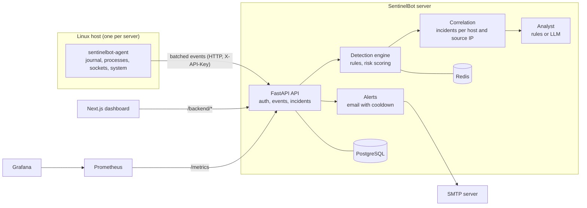

# SentinelBot

**Self-hosted host security monitoring for Linux servers.**

SentinelBot watches your servers for signs of trouble: SSH brute-force attempts, root logins, suspicious authentication bursts, unexpected privileged processes, and unexpected open ports. It groups related findings into incidents, scores their risk, sends email alerts, and shows everything in a web dashboard with Prometheus metrics and Grafana.

Everything runs on your own infrastructure. No data leaves your network unless you enable the optional AI provider.

## Architecture



## Features

- **Agent**: collects authentication events from the systemd journal or auth log files, plus process, listening-socket and system health snapshots. Sends events in batches and keeps a read cursor so restarts do not replay history.
- **Detection rules** with explicit, documented thresholds:
  - `ssh_bruteforce`: repeated failed SSH logins from one source
  - `root_login`: successful direct root login over SSH
  - `auth_burst`: unusually many authentication attempts on one host
  - `privileged_process`: a new root-owned process compared with a learned baseline
  - `unexpected_port`: a listening port that is not on your allowlist
- **Risk scoring**: each finding gets a 0-100 score and a severity band. A rule's own severity is a floor the score can raise but never lower.
- **Incidents**: findings from the same host and source IP are grouped together. Incidents move through open, investigating, resolved, and false positive.
- **Analyst**: an offline, rule-based analysis is always available. An optional Anthropic provider can draft a richer explanation. Its output is validated against a strict schema, and confidence is capped when there is little evidence.
- **Alerts**: email over STARTTLS, with a minimum severity, a per-incident cooldown, and an escalation path that bypasses the cooldown.
- **Access control**: user accounts with `viewer`, `analyst` and `admin` roles, scrypt password hashing, signed tokens, and login rate limiting. Agents authenticate with an API key.
- **Dashboard**: Next.js pages for overview, incidents, events, hosts, network and settings.
- **Monitoring**: Prometheus metrics at `/metrics` and a provisioned Grafana dashboard.
- **Deployment**: Docker Compose for a single host, and Kubernetes manifests for a cluster with an agent on every node.

## Quick start (Docker Compose)

Requirements: Docker with the Compose plugin, and a Linux host.

```bash
git clone https://github.com/AlirezaRg/sentinelbot.git
cd sentinelbot
cp .env.example .env          # fill in every value marked "change me"
docker compose up -d --build
```

Create the first dashboard user:

```bash
docker compose exec sentinel-api sentinelbot-api create-user --username admin --role admin
```

Then open:

| Service | URL | Notes |
| --- | --- | --- |
| Dashboard | http://127.0.0.1:3001 | Sign in with the user you created |
| API health | http://127.0.0.1:8000/health | Public |
| Prometheus | http://127.0.0.1:9090 | Bound to localhost |
| Grafana | http://127.0.0.1:3000 | Admin password from `.env` |

The full setup, including secrets and the journal group ID, is in [docs/deployment.md](docs/deployment.md).

## Kubernetes

The manifests in [`k8s/`](k8s/) are a kustomize base. The agent runs as a DaemonSet on every node. They have been tested on a two-node k3s cluster.

```bash
cp k8s/secret.example.yaml k8s/secret.yaml   # fill in real values; never commit this file
kubectl apply -k k8s/
```

See [`k8s/README.md`](k8s/README.md) and [docs/deployment.md](docs/deployment.md) for details.

## Configuration

All settings are environment variables prefixed with `SENTINEL_`. The most important ones:

| Variable | Used by | Purpose |
| --- | --- | --- |
| `SENTINEL_API_KEY` | API, agent | Service key for agents (at least 32 characters) |
| `SENTINEL_AUTH_SECRET` | API | Signs login tokens (at least 32 characters) |
| `SENTINEL_DATABASE_URL` | API | PostgreSQL connection string |
| `SENTINEL_REDIS_URL` | API | Shared detection state across workers |
| `SENTINEL_ALLOWED_PORTS` | API | Ports that may listen without an alert |
| `SENTINEL_ALERT_MIN_SEVERITY` | API | Lowest severity that sends an email (default `high`) |
| `SENTINEL_SMTP_HOST`, `SENTINEL_SMTP_FROM`, `SENTINEL_ALERT_RECIPIENTS` | API | Email alerts |
| `SENTINEL_AI_PROVIDER` | API | `rules` (default, offline) or `anthropic` |
| `SENTINEL_API_URL` | Agent | Where the agent sends events |

Each package reads its own settings. See `config.py` or `settings.py` in each package for the full list.

## Project layout

| Path | Contents |
| --- | --- |
| `agent/` | Host agent and collectors |
| `detection/` | Detection rules, risk scoring, correlation, Redis state |
| `database/` | SQLAlchemy models and Alembic migrations |
| `alerts/` | Alert channels, policy and notifier |
| `ai/` | Analyst, rule-based analysis and LLM providers |
| `backend/` | FastAPI application |
| `frontend/` | Next.js dashboard |
| `docker/` | Dockerfiles for the API, agent and dashboard |
| `k8s/` | Kubernetes manifests |
| `monitoring/` | Prometheus and Grafana provisioning |
| `docs/` | Architecture, detection rules, development, deployment, security |

## Documentation

Setup and operation:

- [Development](docs/development.md)
- [Deployment](docs/deployment.md)
- [Security model and known limitations](docs/security.md)
- [Live demo](docs/live-demo.md)

Design and explanation:

- [Architecture](docs/architecture.md) and [architecture explained](docs/architecture-explained.md)
- [Detection rules](docs/detection-rules.md)
- [Risk scoring](docs/risk-scoring-explained.md)
- [Correlation and incidents](docs/correlation-explained.md)
- [AI analyst](docs/ai-analyst-explained.md)
- [Technology decisions](docs/technology-decisions.md)
- [Simplification report](docs/simplification-report.md)

Evaluation and study material:

- [Laboratory experiments](docs/laboratory-experiments.md)
- [Evaluation methodology](docs/evaluation.md)
- [Project audit](docs/project-understanding.md) and [what must be understood](docs/must-understand.md)
- [Development journey](docs/development-journey.md)
- [Defense preparation](docs/defense-preparation.md) and [presentation outline](docs/presentation-outline.md)

## Laboratory

Synthetic SSH scenarios run through the real agent, detection and correlation code, with no network access and no real attack:

```powershell
.lab\venv\Scripts\python.exe scripts\lab\run_scenario.py all --out .lab\runs
```

See [docs/laboratory-experiments.md](docs/laboratory-experiments.md) for setup, expected results, and the recorded run.

## Status

SentinelBot is a working end-to-end system: agent, detection, incidents, alerts, dashboard, metrics, and both Compose and Kubernetes deployments. It is not yet hardened for internet exposure. Known gaps are listed in [docs/security.md](docs/security.md), including a shared baseline across nodes and a placeholder Containers page.

## Contributing

Contributions are welcome. Read [CONTRIBUTING.md](CONTRIBUTING.md) first. For security issues, follow [SECURITY.md](SECURITY.md) and do not open a public issue.

## License

MIT. See [LICENSE](LICENSE).
