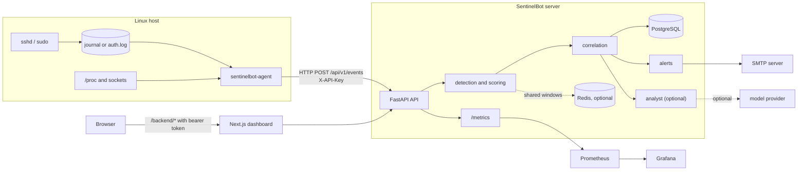
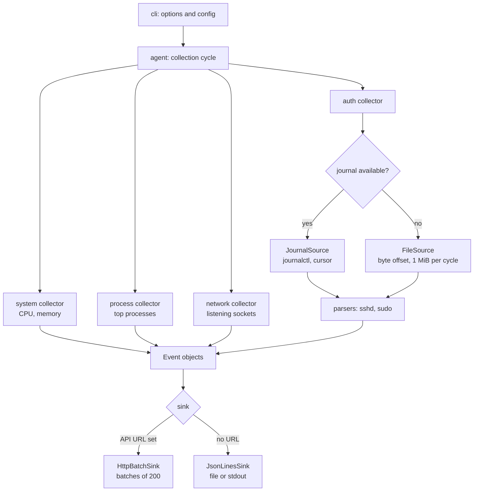
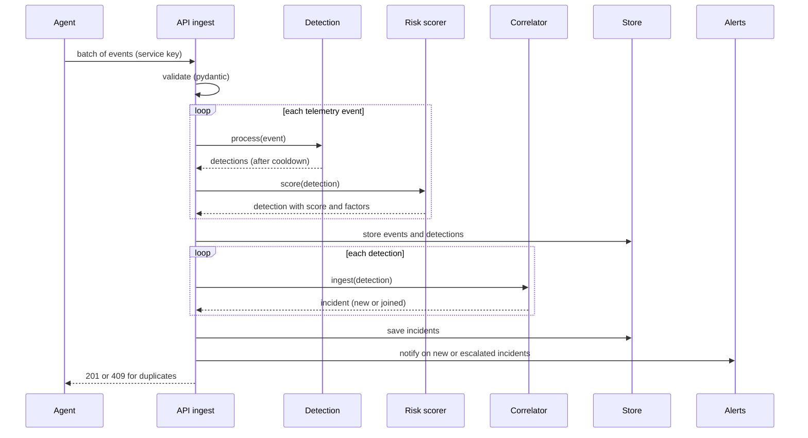
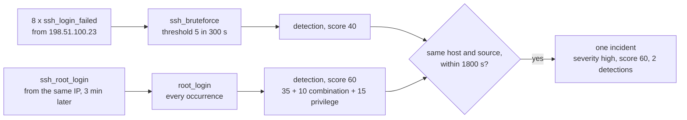
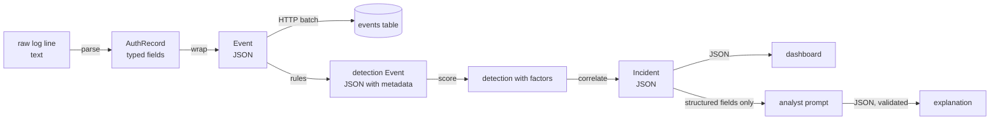
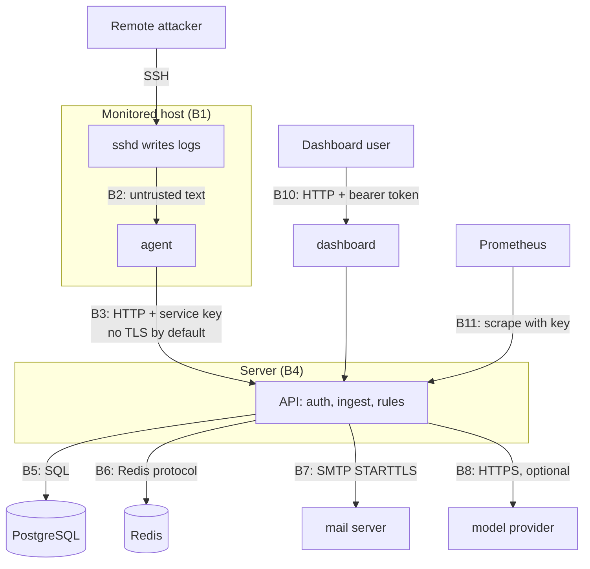
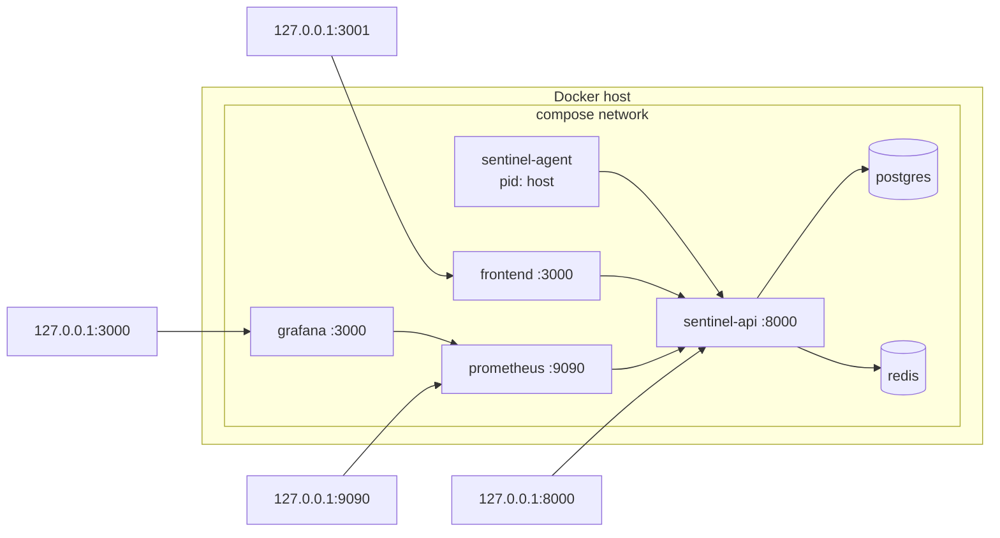
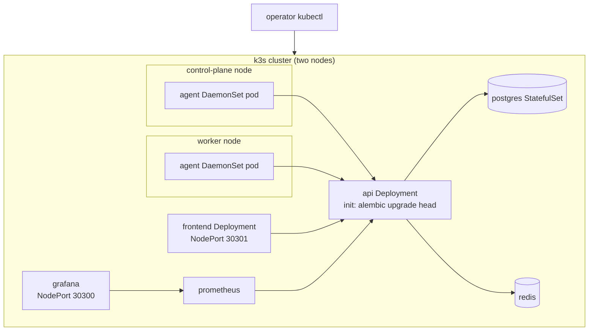

# Diagrams

All diagrams are Mermaid, so they render on GitHub and stay under version control. Each diagram lists what it shows and what it deliberately leaves out.

## 1. Overall architecture

Shows the components and the protocols between them. Leaves out the dashboard's internal structure.

## 2. Agent architecture

Shows the collectors and the sink. Leaves out the HTTP retry details.

## 3. Event processing pipeline

Shows what happens to an event from arrival to storage. Leaves out database transactions.

## 4. Detection and correlation pipeline

Shows how one attack moves from events to an incident. Uses the lab campaign as the example.

## 5. Data flow

Shows which data crosses which component, and in what format. Leaves out error paths.

## 6. Threat model and trust boundaries

Shows the boundaries described in `threat-model.md`. Each boundary is labeled with the protocol and the authentication used.

## 7. Deployment architecture (Docker Compose, one host)

Shows the services and the ports published on the host. Leaves out volumes.

## 8. Kubernetes architecture

Shows the workloads and the node-level agent. Leaves out the init container's migration step.

